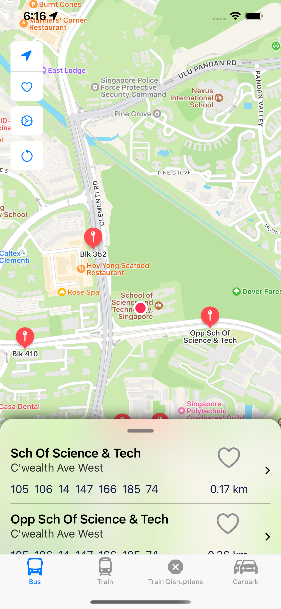
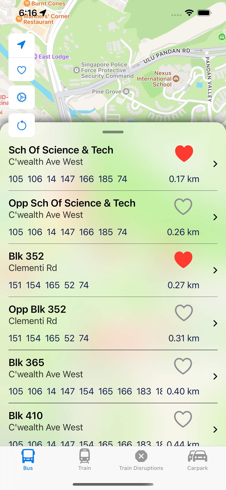
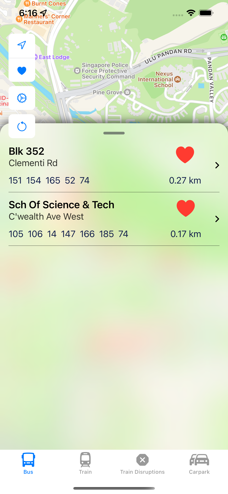
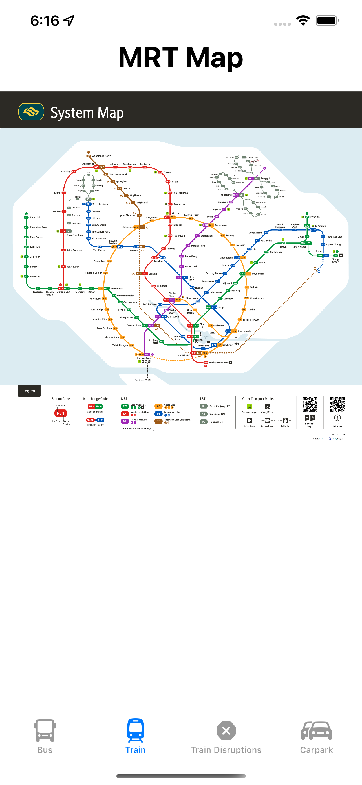
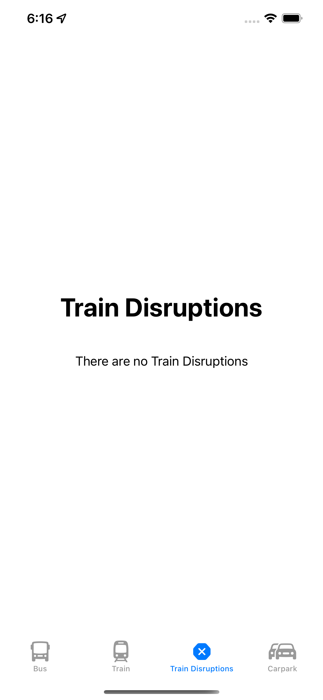
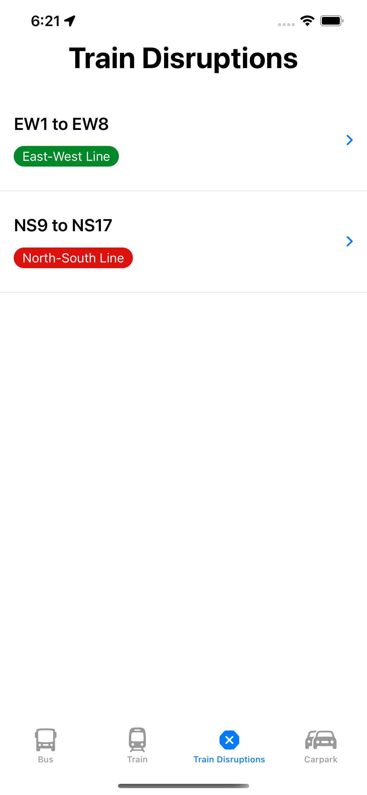
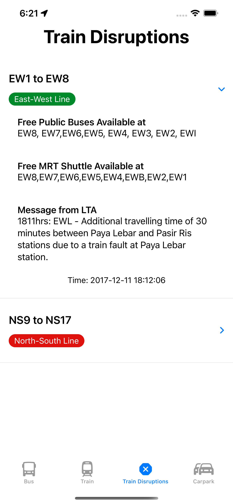
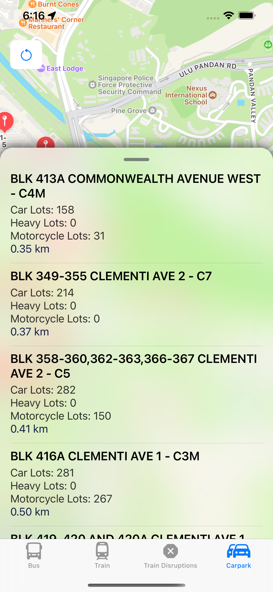

# ArrivalSG
ArrivalSG provides both bus arrival timings and it includes information on train disruptions in real time. It also allows users to view the first and last bus timings. It is the perfect travel companion when you are using public transportation.
## App Screenshots

  
  

## Features
1. See upcoming buses in nearby bus stops
2. MRT Map
3. MRT Train Disruptions (if any)
4. Carpark Availability